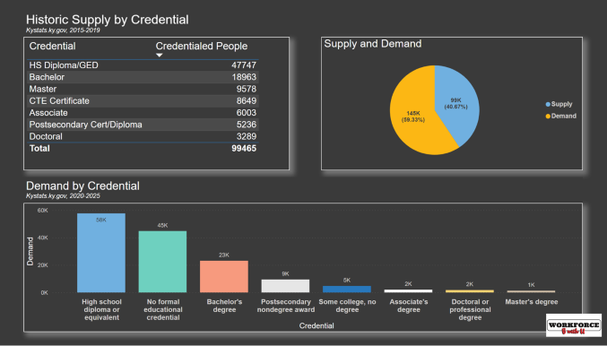
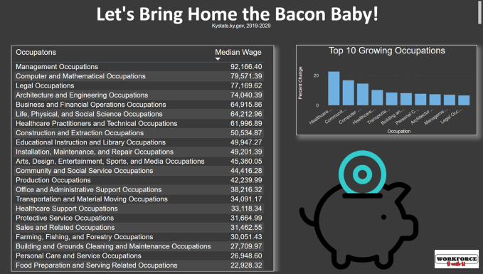

# **Workforce Be With You**

### *Group Project by Gwen Duncan, Keshia Hines, Sonia Ruiz & Carolyn Cain*
 
This repo houses a Microsoft Power BI Project on the workforce development in the Louisville, KY area. We took workforce and unemployment data from the Bureau of Labor Statistics (BLS.gov) and KYStats.ky.gov to analyze which educational credentials were most in demand, which occupations had the highest projected growth and demand. Then, we did a chart of the wages of those occupations in high demand, and high growth. 
 
**Supply & Demand:**
 

 
**Bring Home the Bacon:**
 

